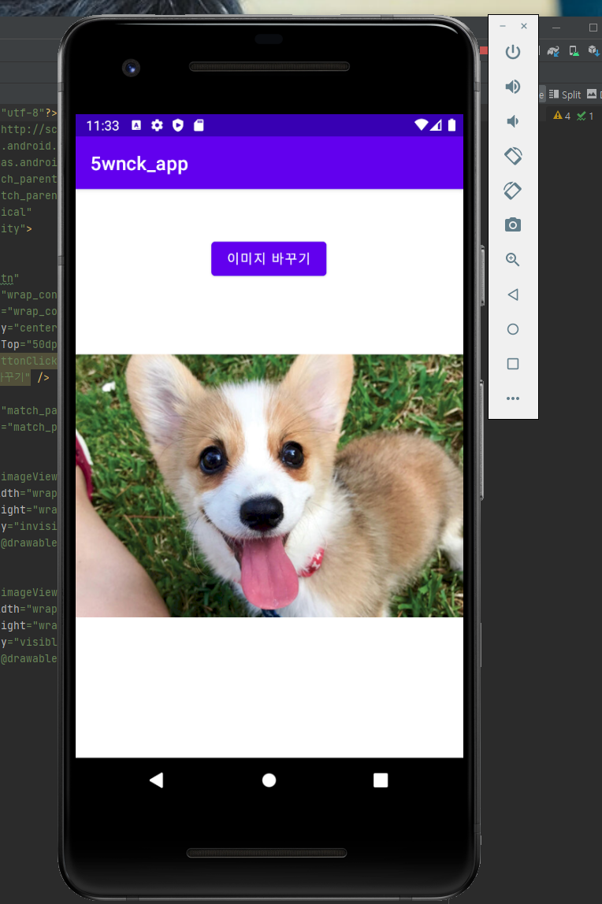
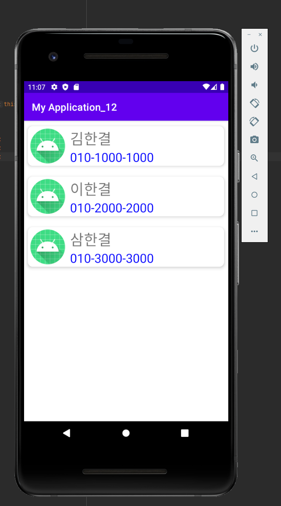

## 19273005 함채현 캡스톤디자인

### 13주차 과제

</img>
  
### 2주차 과제

</img>
  
### 3주차 과제

</img>
</img>
  
### 4주차 과제

</img>
  
### 5주차 과제

</img>
</img>
  
### 6주차 과제

</img>
</img>
</img>
</img>
</img>
  
### 9주차 과제

</img>
  
### 10주차 과제

</img>
</img>
</img>
</img>
</img>
</img>
</img>
  
### 11주차 과제

</img>
</img>
</img>
  
### 12주차 과제

</img>
  
  
